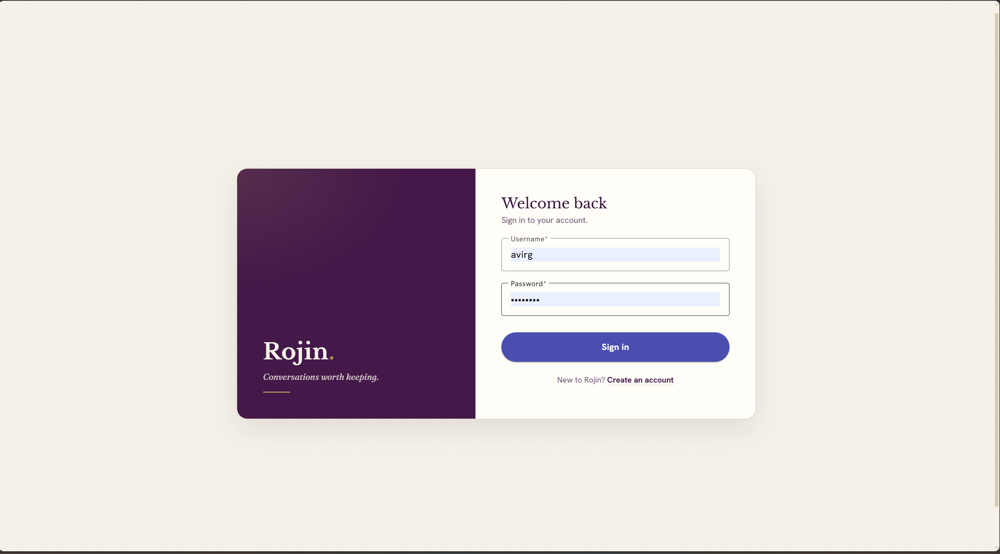
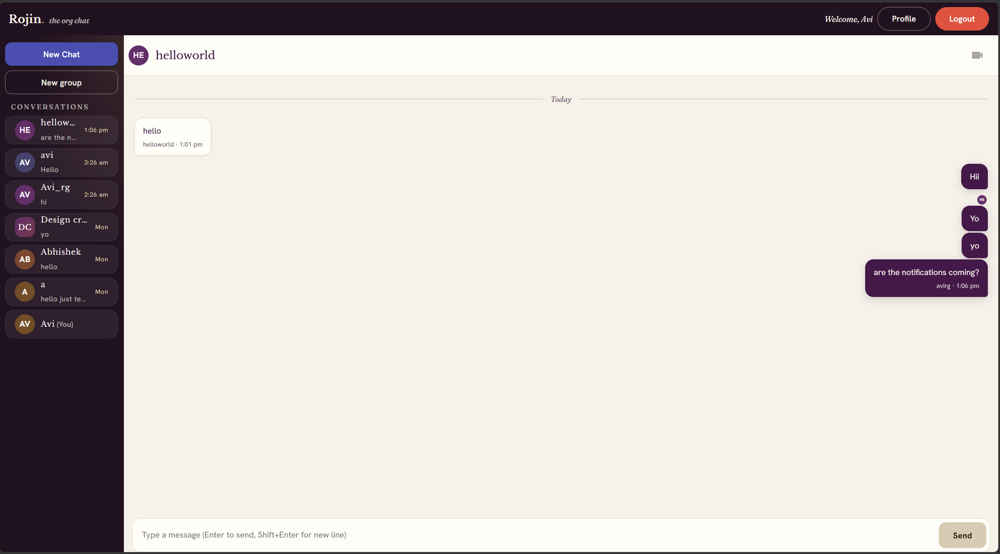
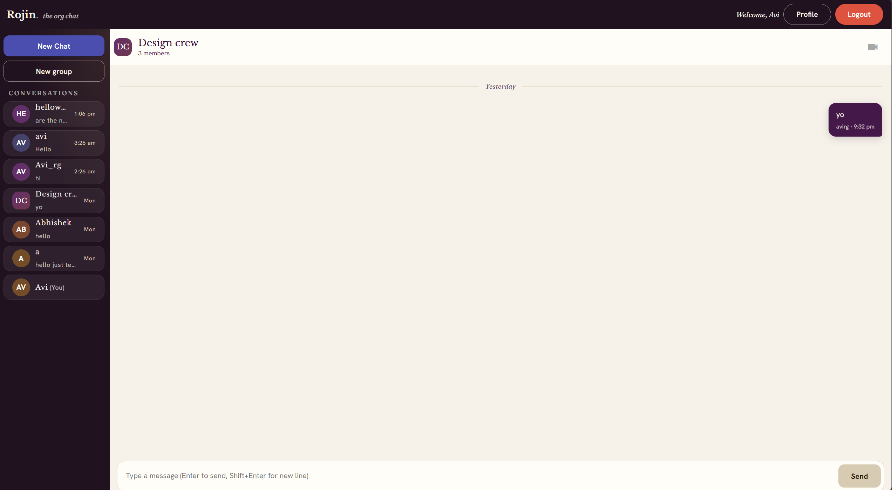
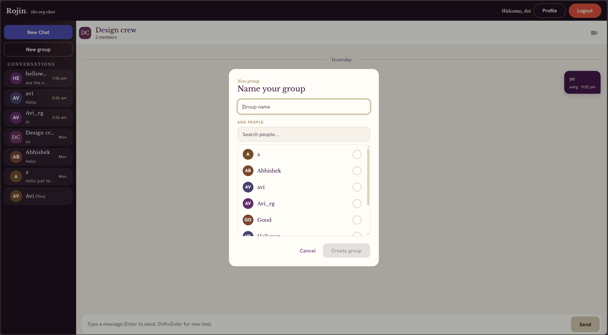
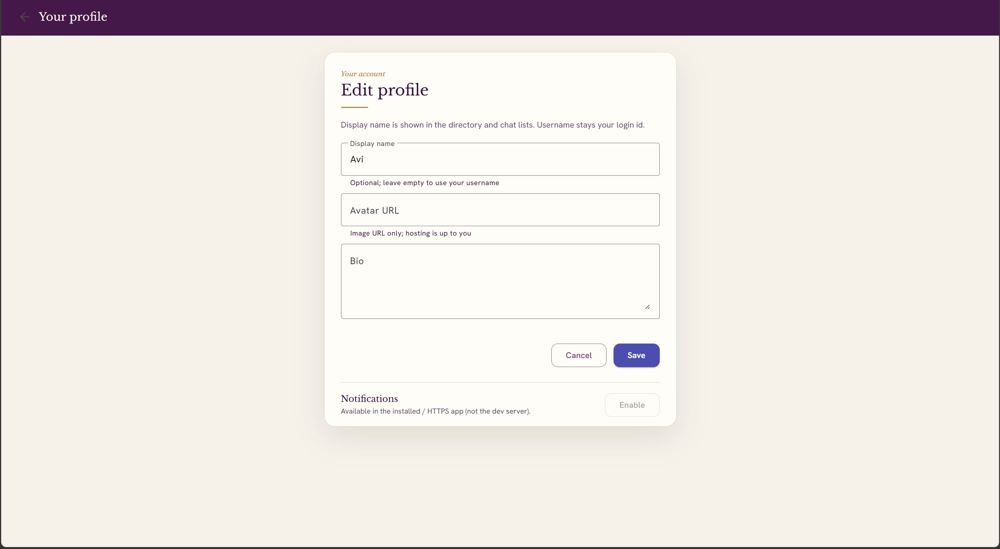
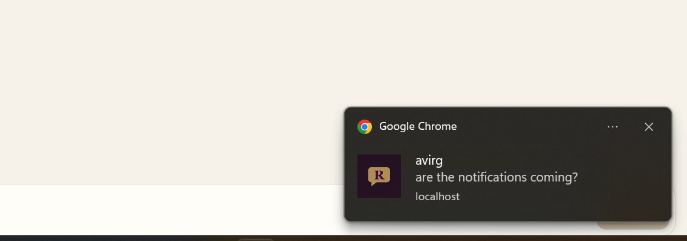

# Rojin — Real‑Time Chat (Angular 21 + Flask + Socket.IO)

A full‑stack real‑time chat app: an **Angular 21** SPA talking to a **Flask + Flask‑SocketIO** backend over **SQLite**. JWT auth, **direct *and* group** conversations, live delivery, read receipts, an installable **PWA**, and **Web Push** notifications — wrapped in a bespoke "Aubergine Atelier" visual design.

> The dev stack runs as two processes; the Angular dev server proxies `/api` and `/socket.io` to Flask. Deeper docs live in [`docs/`](./docs) and [`deployment/`](./deployment); agent/contributor guidance is in [`CLAUDE.md`](./CLAUDE.md).

## Features

- **Auth** — sign up / sign in with JWT; secrets are fail‑fast in production mode.
- **Direct messages** — real‑time 1:1 chat with persistence.
- **Group chats** — create groups, add/remove members, leave; live delivery via per‑conversation Socket.IO rooms; sender attribution in the thread.
- **Reliable send** — optimistic UI with a **failed‑state + retry** (messages never silently vanish).
- **Unread + recency** — conversation list sorted most‑recent‑first with **last‑message previews**, **unread count badges**, and a tab‑title badge. Unread is **server‑backed** (survives reload, counts messages received while away).
- **Read receipts** — "seen" reader avatars under messages (DMs and group "Seen by N").
- **Typing indicators** — live "is typing…" with a throttled, auto‑clearing bubble.
- **Presence** — online users; live‑appearing new conversations.
- **Profiles** — display name, avatar, bio; initials‑avatar fallback; directory search.
- **Design** — "Aubergine Atelier" system (Angular Material **MDC + M3** theming, charcoal chrome, gold accents), WCAG‑AA tuned, with refined motion.
- **PWA** — installable, offline app‑shell, branded icon.
- **Web Push** — opt‑in notifications (Profile toggle) even when the app is closed; tap‑to‑open. *(Requires VAPID keys + a secure context — see below.)*

## Tech stack

- **Frontend** — Angular 21 (TypeScript, NgModules), Angular Material (MDC + M3), `socket.io-client`, `@angular/service-worker` (ngsw) + a custom service worker.
- **Backend** — Python, Flask, Flask‑SocketIO (eventlet), Flask‑JWT‑Extended, Flask‑Bcrypt, Flask‑CORS, `pywebpush`, `python-dotenv`.
- **Database** — SQLite (conversation‑centric schema).
- **Tooling** — `pytest` (backend), GitHub Actions CI, Caddy + mkcert (LAN HTTPS), `sharp` (PWA icon rasterization).

## Project structure

```
backend/
  main.py                # starts Flask-SocketIO server
  requirements.txt       # runtime deps   (requirements-dev.txt: pytest)
  pytest.ini, .env.example
  chat/
    __init__.py          # Flask app + SocketIO + JWT + VAPID; fail-fast secrets
    user.py              # auth routes (signup/signin/signout)
    chatfunc.py          # DM REST, chats_history, Socket.IO events (per-conversation rooms)
    groups.py            # group REST endpoints (create/members/messages/read)
    conversations.py     # conversation + room + read/unread helpers
    profile.py           # JWT profile APIs
    push.py              # Web Push (VAPID, subscriptions, send_push_to_user)
    database.py          # SQLite connection + schema + idempotent migrations
  tests/                 # pytest: auth, dm, groups, read, push, helpers, socket
client/
  src/
    app/
      signin/ signup/ profile/        # auth + profile (+ notifications toggle)
      chat/                           # chat UI, conversation model, group-create dialog
      ui/                             # shared UI + Atelier design tokens / M3 theme
      push.service.ts, auth.service.ts, profile.service.ts
  public/                # PWA manifest, sw-custom.js, icons
  ngsw-config.json, proxy.conf.json   # service worker config + dev proxy
deployment/              # home-deployment.md, Caddyfile, serve-https.ps1, https-tls.md
docs/                    # system-design, security, evolution, glossary
.github/workflows/ci.yml # backend pytest + frontend build on every push/PR
```

## Local setup (Windows / PowerShell)

**Prerequisites:** Python 3.10+ and **Node.js 22+ / npm 11** (the lockfile is npm 11; CI uses Node 24. Node 20's npm 10 fails `npm ci`).

### 1) Backend

```powershell
cd backend
python -m venv .venv
.\.venv\Scripts\Activate.ps1
pip install -r requirements.txt
copy .env.example .env          # then edit it (see note below)
python main.py                  # http://localhost:3000
```

> **Setup gotcha — `FLASK_DEBUG`.** It defaults to **false**, and when off the server **refuses to start unless `SECRET_KEY` + `JWT_SECRET_KEY` are set** (no repo‑known secrets in a real run). For the easy local "just run it" path, put **`FLASK_DEBUG=true`** in `backend/.env` — that enables auto‑reload and lets the dev secret fallbacks apply. See `backend/.env.example` for all knobs (`CORS_ORIGINS`, `JWT_ACCESS_TOKEN_DAYS`, and `VAPID_*` for Web Push).

Backend tests:

```powershell
pip install -r requirements-dev.txt
pytest -q                        # isolated temp DB; never touches chat.db
```

### 2) Frontend

```powershell
cd client
npm install
npm run start                    # ng serve on http://localhost:4200
npm run build                    # production build (the PWA service worker only runs here)
```

The dev server proxies `/api/*` and `/socket.io/*` (WebSocket) to `http://localhost:3000`.

## API (backend)

**Auth:** `POST /api/signup`, `POST /api/signin`, `POST /api/signout`*

**Conversations & messages** *(all JWT):*
- `GET /api/chats_history` — DMs **and** groups, each tagged `kind`, with `unread_count`, last message + time
- `GET /api/directory_users` — everyone except you (New‑Chat search)
- `GET /api/dm/messages/<user>` → `{ messages, read_state }` · `POST /api/dm/messages` `{to_username, body}` · `POST /api/dm/<user>/read`
- `POST /api/groups` `{title, members}` · `GET|PATCH /api/groups/<id>` · `POST /api/groups/<id>/members` · `DELETE /api/groups/<id>/members/<user>` · `POST /api/groups/<id>/leave`
- `GET /api/groups/<id>/messages` → `{ messages, read_state }` · `POST /api/groups/<id>/messages` `{body}` · `POST /api/groups/<id>/read`

**Profiles** *(JWT):* `GET|PATCH /api/me/profile`, `GET /api/users/<user>/profile`

**Web Push** *(JWT):* `GET /api/push/vapid-key`, `POST /api/push/subscribe`, `POST /api/push/unsubscribe`

**Socket.IO** *(JWT in the connect query):* client emits `send_message`, `typing`; server emits `receive_message`, `peer_typing`, `online_users`, `conversation_added`, `conversation_removed`, `conversation_read`.

\* `signout` and all "JWT" routes require an `Authorization: Bearer <token>` header.

## Deployment & PWA on a phone

- **Home/LAN (HTTP):** [`deployment/home-deployment.md`](./deployment/home-deployment.md) — same‑Wi‑Fi access, firewall rules, stopping cleanly.
- **HTTPS harness (for PWA install + Web Push):** [`deployment/https-tls.md`](./deployment/https-tls.md) — `deployment/serve-https.ps1` serves the built PWA over trusted TLS at `https://Avi.local` (Caddy + mkcert). A service worker / push **needs a secure context**; plain‑HTTP LAN won't register it.
- **Web Push:** generate a VAPID keypair into `backend/.env` (one‑liner in `.env.example`), then enable in **Profile → Notifications** on a device served over HTTPS (iOS requires the PWA be installed).

## More docs

- [`docs/system-design.md`](./docs/system-design.md) — architecture, sequence diagrams, full event tables.
- [`docs/security.md`](./docs/security.md) — threat models + hardening checklists (read before touching auth/CORS/Socket.IO).
- [`docs/evolution.md`](./docs/evolution.md) — roadmap + what's delivered.
- [`docs/glossary.md`](./docs/glossary.md) — JWT / CORS / SPA / Socket.IO terms.

## Screenshots

<table>
  <tr>
    <td width="50%"><br><sub><b>Sign in</b> — the Aubergine Atelier hero + paper form.</sub></td>
    <td width="50%"><br><sub><b>Direct message</b> — charcoal sidebar with unread/preview cards; paper &amp; plum bubbles; a "seen" reader avatar.</sub></td>
  </tr>
  <tr>
    <td><br><sub><b>Group chat</b> — monogram header + member count.</sub></td>
    <td><br><sub><b>New group</b> — name it and multi-select members.</sub></td>
  </tr>
  <tr>
    <td><br><sub><b>Profile</b> — display name / avatar / bio + the Notifications (Web Push) toggle.</sub></td>
    <td><br><sub><b>Web Push</b> — a real notification (branded icon, sender + preview) when the app isn't focused.</sub></td>
  </tr>
</table>

## Notes

- Configured for **local / LAN testing**; the committed Flask secrets are **dev‑only** fallbacks (and only used when `FLASK_DEBUG=true`).
- Single shared SQLite connection + in‑process presence ⇒ **single‑process** by design (don't add workers without changes — see `CLAUDE.md`).
