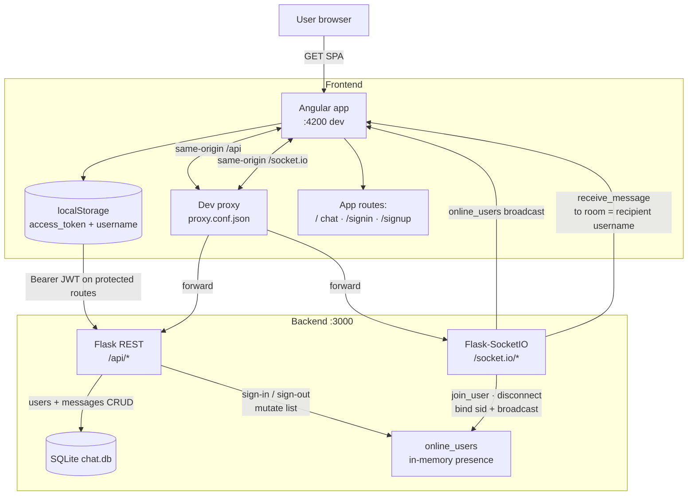
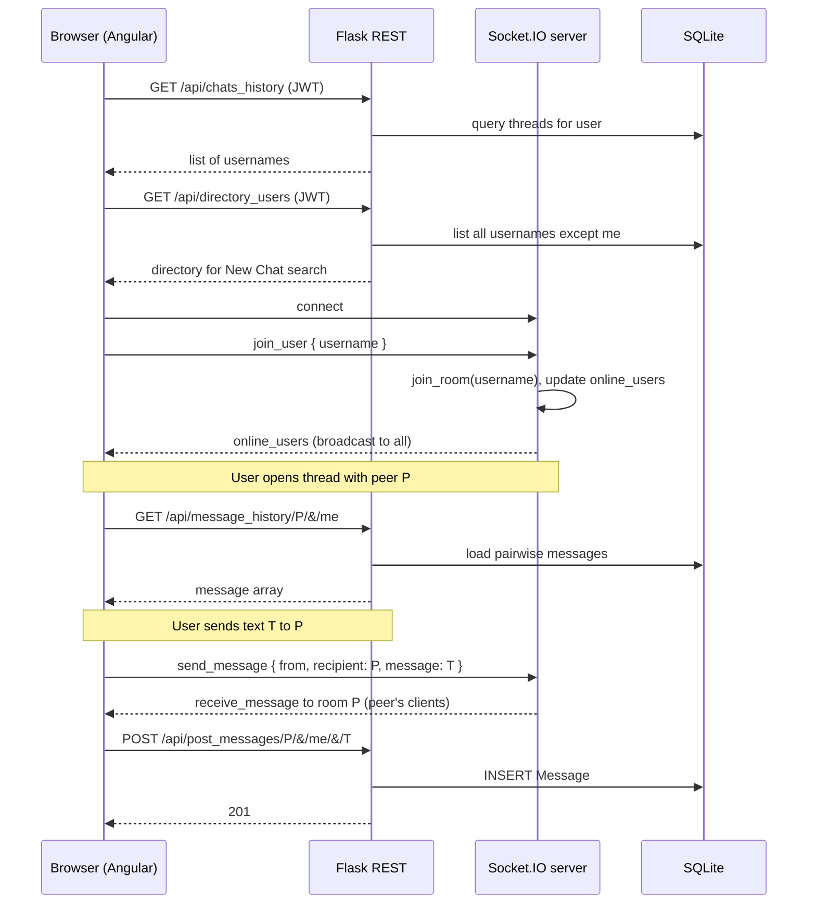

# System design — Rojin (the org chat)

High-level architecture for the **Angular + Flask + Socket.IO** stack: how pieces connect, how data moves, and where to look in the repo. For **security posture and hardening**, see [`security.md`](./security.md). For **LAN / Wi‑Fi deployment**, see [`../deployment/home-deployment.md`](../deployment/home-deployment.md).

---

## Overview

- **Frontend**: Angular SPA (dev server **:4200**), Angular Material, `socket.io-client`. JWT and username live in **`localStorage`**. In development, **`proxy.conf.json`** forwards `/api` and `/socket.io` to the backend.
- **Backend**: Single process runs **Flask** REST and **Flask-SocketIO** on **:3000** (see `backend/main.py`). **SQLite** (`chat.db`, created next to the working directory when the backend runs from `backend/`) stores users and messages. **Presence** is an in-memory list **`online_users`**: `(username, socket_session_id_or_empty)`.
- **Realtime DMs**: Each connected client **joins a Socket.IO room named after their username** (`join_user`). Sending a message **emits `receive_message` into the recipient’s room** so delivery does not depend on a fragile socket-id map in the UI.

---

## Architecture diagram

**Production note**: You would typically serve the built Angular app and API under one **HTTPS** origin (or two known origins with strict CORS). The proxy exists for **local development** only.

---

## Sequence: chat screen and realtime session

If the peer is **offline**, the Socket.IO emit reaches **no sockets** in room `P`, but **HTTP POST still persists** the message for when they load history later.

---

## Data model (SQLite)

| Table | Purpose | Main columns |
|-------|---------|----------------|
| **User** | Accounts | `id`, `username` (unique), `password` (bcrypt hash) |
| **Message** | DM history | `id`, `sender_id`, `recipient_id`, `message`, `timestamp` (ISO string) |

Schema is created in `backend/chat/database.py`. Foreign keys reference `User.id`.

---

## HTTP API summary

| Method | Path | JWT | Role |
|--------|------|-----|------|
| POST | `/api/signup` | No | Register user |
| POST | `/api/signin` | No | Login; returns `access_token`; server adds user to `online_users` with empty sid until socket `join_user` |
| POST | `/api/signout` | Yes | Logout; remove user from `online_users` |
| GET | `/api/chats_history` | Yes | Usernames you have thread history with (includes self) |
| GET | `/api/directory_users` | Yes | All registered usernames except you (New Chat search) |
| GET | `/api/message_history/<u1>/&/<u2>` | No* | Pairwise message list |
| POST | `/api/post_messages/<recipient>/&/<sender>/&/<message>` | No* | Persist one message (body still URL-encoded today) |

\*See [`security.md`](./security.md): these routes should be JWT-bound and use JSON bodies in a hardened deployment.

---

## Socket.IO events (client ↔ server)

| Direction | Event | Payload (conceptually) | Server behavior |
|-----------|--------|---------------------------|-----------------|
| C → S | *(connect)* | — | Accept connection |
| C → S | `join_user` | `{ username }` | `join_room(username)`; set `online_users` row for that user to current `sid`; broadcast `online_users` |
| S → all | `online_users` | `[[username, sid], ...]` | Clients refresh presence + search lists |
| C → S | `send_message` | `{ from, recipient, message }` | `emit('receive_message', …, room=recipient)` |
| S → room | `receive_message` | `{ username, message, datetime }` | `username` is the **sender**; client appends to thread keyed by sender |
| — | `disconnect` | — | Clear matching `sid` in `online_users`; broadcast `online_users` |

Legacy: server still accepts `recipientsid` instead of `recipient` for older clients.

---

## What happens when…

### User signs up
- Angular: `POST /api/signup` with `{ username, password }`.
- Backend: bcrypt hash → insert **User** in SQLite.

### User signs in
- Angular: `POST /api/signin` → stores `access_token` and `username` in **localStorage**.
- Backend: verifies password, returns JWT; appends **`(username, "")`** to **`online_users`** (socket id filled in when the client emits **`join_user`**).

### Chat screen loads (`ChatComponent`)
- `GET /api/chats_history` (JWT) → sidebar “Direct Messages”.
- `GET /api/directory_users` (JWT) → “New Chat” search pool (everyone except you, not only online).
- Socket.IO **`connect`** → then **`join_user`** with `username` from localStorage.
- On each **`online_users`** broadcast, UI updates online badges / send eligibility hints.

### User opens a conversation with peer `P`
- `GET /api/message_history/P/&/<currentUser>` loads history into the thread.

### User sends a message to `P`
1. **Socket**: `send_message` with `recipient: P` → server emits **`receive_message`** to room **`P`** (all tabs/sessions that joined as `P`).
2. **HTTP**: `POST /api/post_messages/...` persists to **Message** (survives refresh; offline peer sees it later).

### User logs out
- `POST /api/signout` (JWT); localStorage cleared; navigate to sign-in; component **`ngOnDestroy`** disconnects the socket → **`disconnect`** handler updates presence.

---

## Frontend structure (where to read code)

| Area | Location |
|------|----------|
| Routes (`''` → chat, `/signin`, `/signup`) | `client/src/app/app-routing.module.ts` |
| Chat UI, REST, Socket.IO, composer | `client/src/app/chat/chat.component.ts` + `.html` + `.scss` |
| Sign-in / sign-up forms | `client/src/app/signin/`, `client/src/app/signup/` |
| Auth REST helpers | `client/src/app/auth.service.ts` |
| Dev proxy | `client/src/proxy.conf.json` |
| Material + **`BrowserAnimationsModule`** | `client/src/app/app.module.ts` |

---

## Backend structure

| Area | Location |
|------|----------|
| Flask app, JWT, CORS, Socket.IO init | `backend/chat/__init__.py` |
| Process entry (host/port, debug) | `backend/main.py` |
| Auth routes | `backend/chat/user.py` |
| Chat REST + socket handlers | `backend/chat/chatfunc.py` |
| SQLite connection + DDL | `backend/chat/database.py` |

---

## Assumptions and non-goals (current codebase)

- **Single server process**; **`online_users`** is not shared across multiple backend instances.
- **SQLite** file is fine for demos; scaling out usually means a shared database and sticky sessions or a compatible realtime strategy.
- **Secrets** and **CORS/Socket origins** are development-oriented; production needs env-based secrets, HTTPS, and locked origins (see [`security.md`](./security.md)).
- **No end-to-end encryption**; the server can read message content.
- **Trust model for `join_user`**: the username is supplied by the client; stronger setups authenticate the socket (JWT on connect) — documented as a gap in [`security.md`](./security.md).

---

## Related documentation

- [`security.md`](./security.md) — risks, JWT/message API gaps, production & LAN checklists.
- [`README.md`](../README.md) — setup, API list, features.
- [`../deployment/home-deployment.md`](../deployment/home-deployment.md) — firewall, ports, stopping processes.
