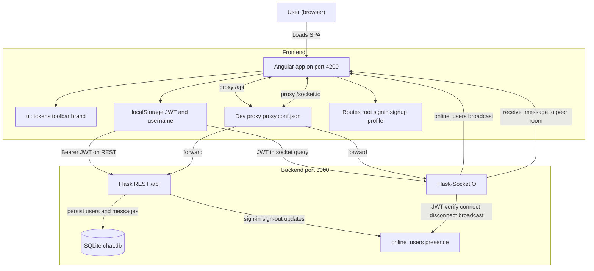
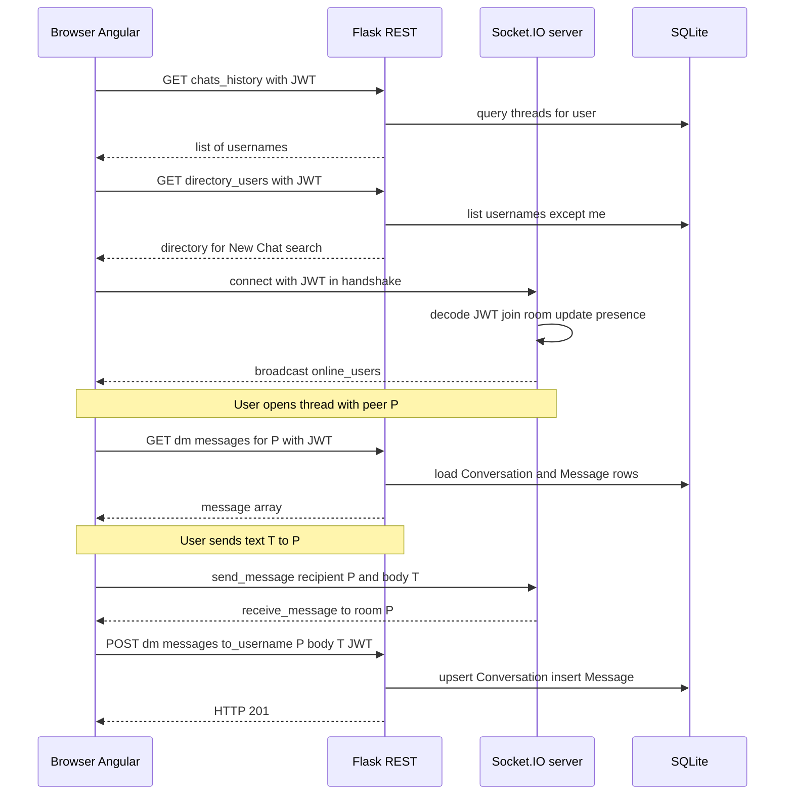

# System design — Rojin (the org chat)

High-level architecture for the **Angular + Flask + Socket.IO** stack: how pieces connect, how data moves, and where to look in the repo. For **terms** (JWT, CORS, SPA, …), see [`glossary.md`](./glossary.md). For **security posture and hardening**, see [`security.md`](./security.md). For **LAN / Wi‑Fi deployment**, see [`../deployment/home-deployment.md`](../deployment/home-deployment.md).

---

## Overview

- **Frontend**: Angular SPA (dev server **:4200**), Angular Material, `socket.io-client`. A small shared **`ui/`** layer holds **design tokens** (SCSS variables and layout mixins) and **dumb presentational components** (toolbar shell, brand lockup) so feature screens stay thin and styling stays consistent. The shell and root layout use **`dvh`** and **`env(safe-area-inset-*)`** where relevant for mobile notches and browser chrome. JWT and username live in **`localStorage`**. In development, **`proxy.conf.json`** forwards `/api` and `/socket.io` to the backend.
- **Backend**: Single process runs **Flask** REST and **Flask-SocketIO** on **:3000** (see `backend/main.py`). **SQLite** (`chat.db`, created next to the working directory when the backend runs from `backend/`) stores users, **conversations** (direct DMs today), and **messages** scoped to `conversation_id`. **Presence** is an in-memory list **`online_users`**: `(username, socket_session_id_or_empty)`.
- **Realtime DMs**: On **authenticated Socket.IO connect** (JWT in the handshake), the server **joins a room named after the JWT username** and tracks **`sid → username`**. Sending a message **emits `receive_message` into the recipient’s room**; the sender is taken only from the socket session, not from the client payload.

---

## Architecture diagram

**Production note**: You would typically serve the built Angular app and API under one **HTTPS** origin (or two known origins with strict CORS). The proxy exists for **local development** only.

---

## Sequence: chat screen and realtime session

If the peer is **offline**, the Socket.IO emit reaches **no sockets** in room `P`, but **HTTP POST still persists** the message for when they load history later.

---

## Data model (SQLite)

| Table | Purpose | Main columns |
|-------|---------|----------------|
| **User** | Accounts | `id`, `username` (unique), `password` (bcrypt hash) |
| **UserProfile** | Optional profile | `user_id` PK/FK → `User`, `display_name`, `avatar_url`, `bio`, `updated_at` |
| **Conversation** | Thread (DM or future group) | `id`, `type` (`direct` \| `group`), `title`, `created_at`, `dm_user_low_id` / `dm_user_high_id` for direct pair (normalized, unique) |
| **ConversationMember** | Membership | `(conversation_id, user_id)` PK, `role`, `joined_at` |
| **Message** | History | `id`, `conversation_id`, `sender_user_id`, `body`, `created_at`; optional `client_message_id` |

Schema is created in `backend/chat/database.py`. A **legacy** pairwise `Message` table (if present) is **dropped on startup** so the file can move to the conversation model without manual SQL (dev-oriented).

---

## HTTP API summary

| Method | Path | JWT | Role |
|--------|------|-----|------|
| POST | `/api/signup` | No | Register user |
| POST | `/api/signin` | No | Login; returns `access_token`; server adds user to `online_users` with empty sid until an **authenticated** socket **connect** |
| POST | `/api/signout` | Yes | Logout; remove user from `online_users` |
| GET | `/api/chats_history` | Yes | Sidebar entries `{ username, display_name }` (you + direct-conversation peers) |
| GET | `/api/directory_users` | Yes | All registered users except you (New Chat search) |
| GET | `/api/dm/messages/<other_username>` | Yes | DM transcript with that user |
| POST | `/api/dm/messages` | Yes | JSON `{ to_username, body }`; sender from JWT |
| GET/PATCH | `/api/me/profile` | Yes | Current user profile |
| GET | `/api/users/<username>/profile` | Yes | Another user’s public profile card |

See [`security.md`](./security.md) for LAN configuration (`.env`, CORS allowlist) and remaining hardening ideas.

---

## Socket.IO events (client ↔ server)

| Direction | Event | Payload (conceptually) | Server behavior |
|-----------|--------|---------------------------|-----------------|
| C → S | *(connect)* | Handshake query **`token`** = access JWT | Reject if missing/invalid; decode JWT → **`sub`** (username); `join_room(username)`; bind **`sid → username`**; update `online_users`; broadcast `online_users` |
| S → all | `online_users` | `[[username, sid], ...]` | Clients refresh presence + search lists |
| C → S | `send_message` | `{ recipient, message }` (optional legacy `recipientsid`) | Sender = **socket JWT identity only**; `emit('receive_message', …, room=recipient)` |
| S → room | `receive_message` | `{ username, message, datetime }` | `username` is the **sender**; client appends to thread keyed by sender |
| — | `disconnect` | — | Drop **`sid`** binding; clear matching `sid` in `online_users`; broadcast `online_users` |

Legacy: server still accepts `recipientsid` instead of `recipient` for older clients. **`join_user`** is removed; presence is established on authenticated **`connect`** only.

---

## What happens when…

### User signs up
- Angular: `POST /api/signup` with `{ username, password }`.
- Backend: bcrypt hash → insert **User** in SQLite.

### User signs in
- Angular: `POST /api/signin` → stores `access_token` and `username` in **localStorage**.
- Backend: verifies password, returns JWT; appends **`(username, "")`** to **`online_users`** (socket id filled in when the client opens the chat and the **JWT-authenticated** socket **connect**s).

### Chat screen loads (`ChatComponent`)
- `GET /api/chats_history` (JWT) → sidebar “Direct Messages”.
- `GET /api/directory_users` (JWT) → “New Chat” search pool (everyone except you, not only online).
- Socket.IO **`connect`** with **`token`** query param (JWT from localStorage); server joins rooms from the token (**no** `join_user`).
- On each **`online_users`** broadcast, UI updates online badges / send eligibility hints.

### User opens a conversation with peer `P`
- `GET /api/dm/messages/P` (JWT) loads history into the thread (empty array until the first message creates the direct **Conversation**).

### User sends a message to `P`
1. **Socket**: `send_message` with `recipient: P` (sender from JWT-bound socket) → server emits **`receive_message`** to room **`P`**.
2. **HTTP**: `POST /api/dm/messages` with JSON body persists a row in **Message** linked to the direct **Conversation** (survives refresh; offline peer sees it later).

### User logs out
- `POST /api/signout` (JWT); localStorage cleared; navigate to sign-in; component **`ngOnDestroy`** disconnects the socket → **`disconnect`** handler updates presence.

---

## Frontend structure (where to read code)

| Area | Location |
|------|----------|
| Routes (`''` → chat, `/signin`, `/signup`) | `client/src/app/app-routing.module.ts` |
| Chat UI, REST, Socket.IO, composer | `client/src/app/chat/chat.component.ts` + `.html` + `.scss` |
| Shared UI module (declares/exports shell + lockup) | `client/src/app/ui/ui.module.ts` |
| Design tokens (colors, breakpoints, toolbar/sidebar sizes, viewport mixins) | `client/src/app/ui/styles/_tokens.scss` (imported from feature SCSS and `client/src/styles.scss`) |
| Toolbar chrome + safe-area top padding | `client/src/app/ui/toolbar-shell/` |
| Brand title + optional tagline | `client/src/app/ui/brand-lockup/` |
| Sign-in / sign-up forms | `client/src/app/signin/`, `client/src/app/signup/` |
| Auth REST helpers | `client/src/app/auth.service.ts` |
| Dev proxy | `client/src/proxy.conf.json` |
| Material + **`BrowserAnimationsModule`** | `client/src/app/app.module.ts` |

### Shared `ui/` layer (tokens + shell)

The chat screen composes **`ToolbarShellComponent`** with projected regions: brand slot (**`BrandLockupComponent`**, tagline hidden on narrow widths) and actions (welcome text, profile, logout). That keeps **feature logic** in `ChatComponent` while **chrome and spacing** live in reusable pieces. Global **`html` / `body`** min-height and the chat host use **`100vh` / `100dvh`** and **`-webkit-fill-available`** where needed; **`index.html`** uses **`viewport-fit=cover`** so **`env(safe-area-inset-*)`** applies on supported devices. New screens can import the same tokens and optionally reuse **`UiModule`** exports without duplicating hex values or toolbar markup.

---

## Backend structure

| Area | Location |
|------|----------|
| Flask app, JWT, CORS, Socket.IO init | `backend/chat/__init__.py` |
| Process entry (host/port, debug) | `backend/main.py` |
| Auth routes | `backend/chat/user.py` |
| Chat REST + socket handlers | `backend/chat/chatfunc.py` |
| SQLite connection + DDL | `backend/chat/database.py` |

---

## Assumptions and non-goals (current codebase)

- **Single server process**; **`online_users`** is not shared across multiple backend instances.
- **SQLite** file is fine for demos; scaling out usually means a shared database and sticky sessions or a compatible realtime strategy.
- **Secrets** and **CORS/Socket origins** are development-oriented; production needs env-based secrets, HTTPS, and locked origins (see [`security.md`](./security.md)).
- **No end-to-end encryption**; the server can read message content.
- **Socket trust model**: username for rooms and **`send_message`** comes from the **JWT** verified at **connect** (see [`security.md`](./security.md)).

---

## Related documentation

- [`evolution.md`](./evolution.md) — planned direction for profiles, group chat, and a conversation-centric data model.
- [`security.md`](./security.md) — risks, JWT/message API gaps, production & LAN checklists.
- [`glossary.md`](./glossary.md) — definitions of common terms.
- [`README.md`](../README.md) — setup, API list, features.
- [`../deployment/home-deployment.md`](../deployment/home-deployment.md) — firewall, ports, stopping processes.
